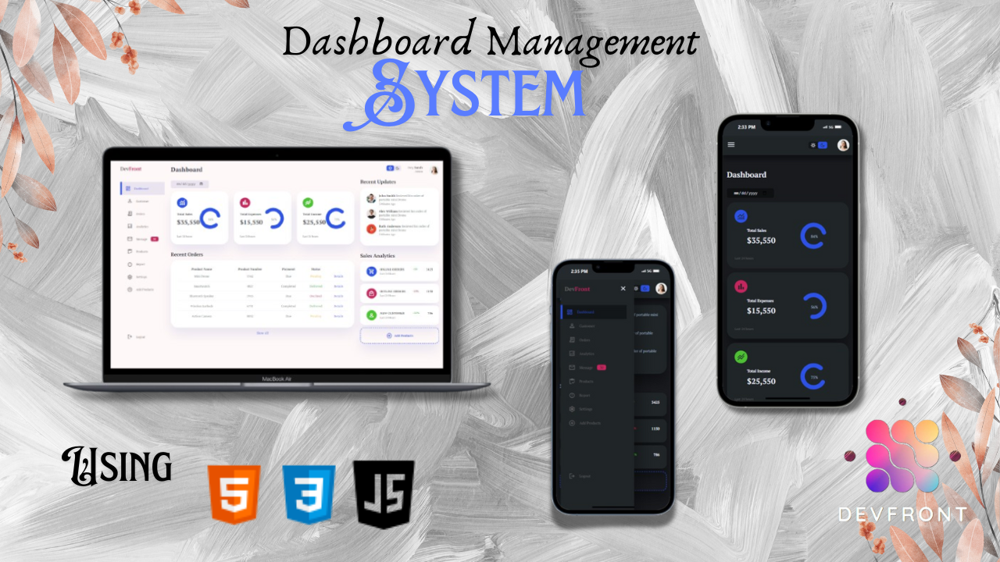
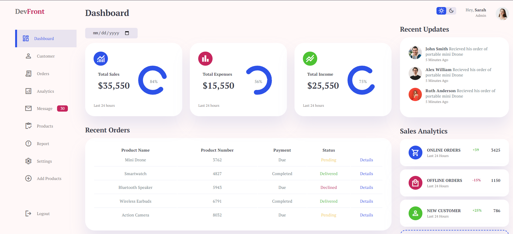

# Dashboard Management System



Welcome to the Dashboard Management System! This project demonstrates a simple yet functional dashboard interface with user authentication, a dynamic sidebar, theme toggling, and order management.

## Table of Contents
- [Overview](#overview)
- [Features](#features)
- [Technologies Used](#technologies-used)
- [Getting Started](#getting-started)
- [Prerequisites](#prerequisites)
- [Installation](#installation)
- [Usage](#usage)
- [File Structure](#file-structure)



## Overview

This Dashboard Management System allows users to log in, view an interactive orders table, toggle between dark and light themes, and navigate through a responsive sidebar. The dashboard is built using HTML, CSS, and JavaScript with a focus on functionality and clean design. The orders data is dynamically loaded and styled based on the order status.

## Features

- **Login Authentication**: Users can log in with a username and password. Successful login redirects to the main dashboard.
- **Responsive Sidebar Menu**: The sidebar menu can be opened or closed using buttons, making the dashboard more interactive.
- **Theme Toggling**: A dark/light theme switcher allows users to choose their preferred viewing mode.
- **Orders Table**: Displays a list of products with payment and delivery statuses. The table updates dynamically based on provided data.
- **Logout Functionality**: Users can log out and be redirected to the login page.

## Technologies Used

- **HTML5**
- **CSS3**
- **JavaScript (ES6)**
- **Google Fonts**
- **CSS Flexbox** for responsive layout

## Getting Started

To get a local copy up and running, follow these simple steps.

### Prerequisites

Make sure you have a code editor like VSCode and a web browser installed.

### Installation

1. Clone the repository:
   ```sh
   git clone https://github.com/yourusername/dashboard-management-system.git
   ```
2. Open the project in your code editor.
3. Open `index.html` in your web browser to start the login process and access the dashboard.

## Usage

1. Open `index.html` and enter the following credentials to log in:
   - **Username**: `admin`
   - **Password**: `password`
2. Once logged in, you will be redirected to `dashboard.html` where you can:
   - Toggle the sidebar using the menu buttons.
   - Switch between dark and light themes using the theme toggle.
   - View the orders table, dynamically generated with real-time status updates.

## File Structure

```plaintext
dashboard-management-system/
│
├── index.html          # Login page
├── dashboard.html      # Dashboard page with orders table
└── assets/
    └── style.css       # Stylesheet for layout and design
    └── script.js       # Script for login, sidebar, and theme toggle
    └── order.js        # Orders data and dynamic table generation
    └── Preview.png     # Project screenshot
```

